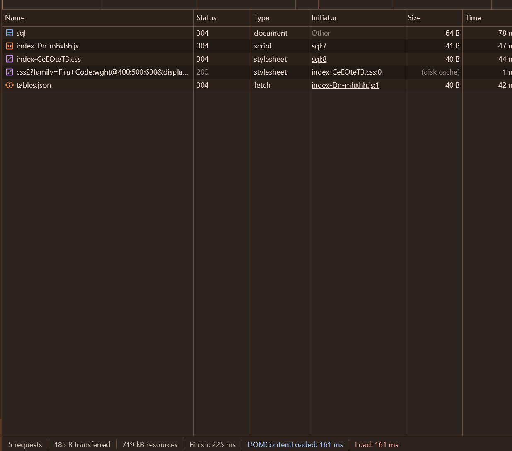
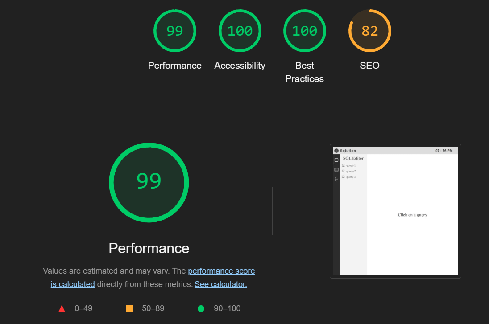

# Sqlution - SQL Query Editor

**Live Demo:** [sqlution.netlify.app](https://sqlution.netlify.app)  
**GitHub Repository:** https://github.com/AshrafMd-1/sqlution

**Sqlution** is a frontend-based SQL query editor that allows users to write, run, and manage SQL queries. It features a code editor, AI-powered query generator, schema viewer, and template manager. The project showcases efficient data rendering, pagination, and a clean, user-friendly interface.

**Tech Stack:**
- **Framework:** React 18 with Vite
- **Language:** TypeScript
- **State Management:** Zustand
- **Code Editor:** CodeMirror with SQL language support
- **AI Integration:** `@google/generative-ai` for AI-powered SQL query generation
- **UI Components:** `react-sliding-pane`, `react-modal`, `react-loader-spinner`
- **Optimization:** `terser` for minified production build
- **Styling:** Custom CSS

**Features and Functionalities:**
- **SQL Editor:** A CodeMirror-based SQL editor with syntax highlighting, tooltips, and auto-completion.
- **Query Execution:** Executes SQL queries and displays the results in a table format below the editor.
- **AI Query Generator:** Generates SQL queries based on natural language prompts using Google’s Generative AI API.
- **Template Manager:** Allows users to save and reuse SQL snippets. Selected SQL text can be saved as a template and inserted into the editor with a single click.
- **Table and Schema Viewer:** Displays table contents with pagination and schema details such as column names and data types.
- **Performance Optimization:** Implements pagination and lazy loading to efficiently handle large datasets.

**Optimizations for Performance:**
- **Efficient Data Fetching:** Fetches table data dynamically from the `public` folder instead of embedding it, improving load speed.
- **Pagination:** Renders large datasets in pages to reduce memory usage and enhance performance.
- **Memoization:** Uses `useCallback()` and `useMemo()` to prevent unnecessary re-renders.
- **Minified Production Build:** Utilizes `terser` to minify the code, reducing the build size.
- **Loading Indicators:** Displays visual loading indicators for better user experience.

**Handling Large Data Sets:**
- Fetches data dynamically rather than embedding large JSON files.
- Uses pagination to display large datasets (800+ rows) efficiently, preventing performance issues.

**Challenges and Resolutions:**
- **SQL Execution Logic:**
    - Extracting column names between `SELECT` and `FROM` to display results.
    - Supports `SELECT *` queries by automatically displaying all columns.
- **Data Rendering:**
    - Used pagination and lazy loading to reduce the load time when displaying large tables.
- **Optimization:**
    - Minified the code and optimized rendering to enhance performance.

**Performance Metrics:**
- **Page Load Times:**
- 
    - 5 requests
    - 693 B transferred
    - 719 kB resources loaded
    - Finish: 437 ms
    - DOMContentLoaded: 373 ms
    - Load: 373 ms
  
- **Lighthouse Scores:**

    - Performance: 99
    - Accessibility: 100
    - Best Practices: 100
    - SEO: 82

**Deployment:**
- **Hosting:** Netlify
- **Live Demo:** [sqlution.netlify.app](https://sqlution.netlify.app)

**Installation and Running Locally:**
1. Clone the repository:  
   `git clone <GitHub-repo-link>`
2. Navigate to the project directory:  
   `cd sqlution`
3. Install dependencies:  
   `npm install`
4. Run the app locally:  
   `npm run dev`
5. Build for production:  
   `npm run build`

**Images:**
