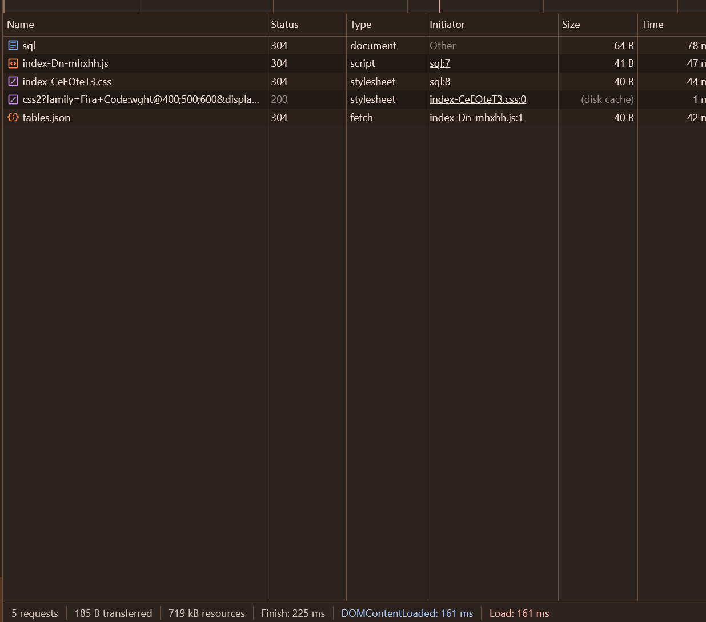
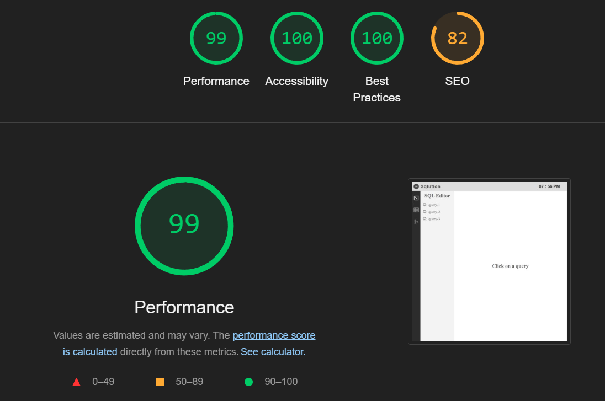
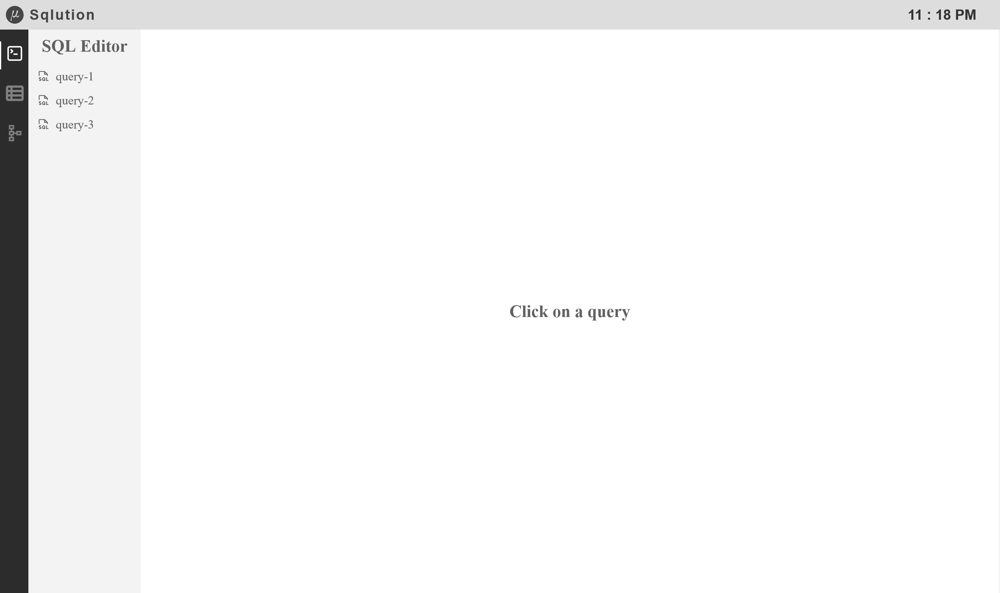
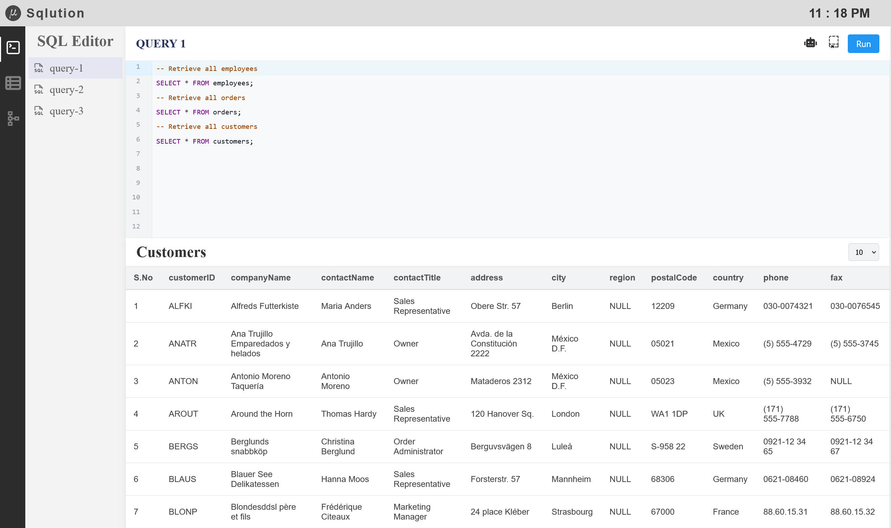
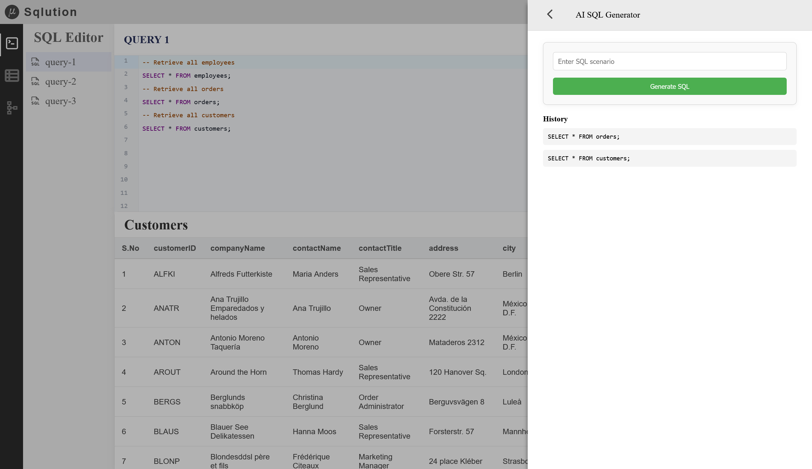
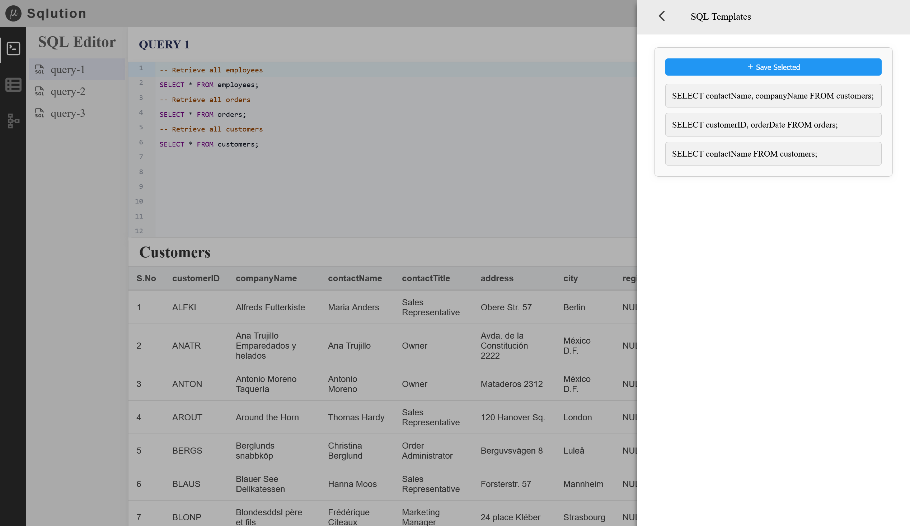
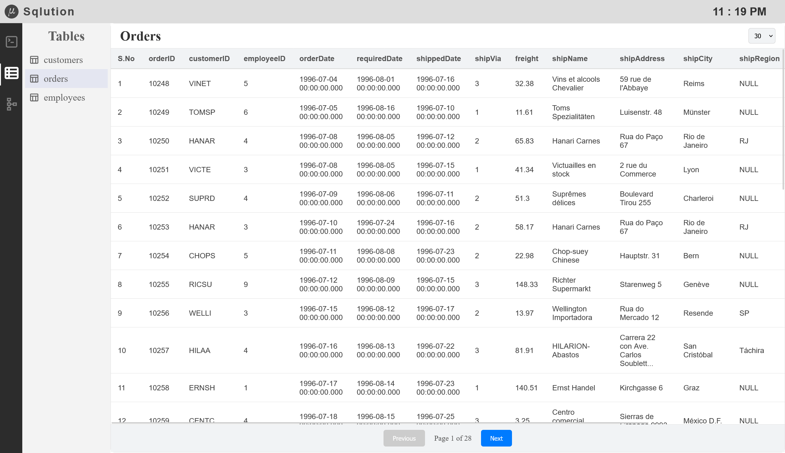
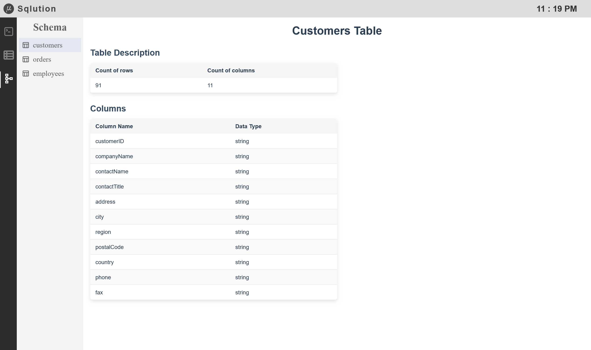

# **Sqlution – SQL Query Editor**

**Live Demo:** [sqlution.netlify.app](https://sqlution.netlify.app)  
**GitHub Repository:** [github.com/AshrafMd-1/sqlution](https://github.com/AshrafMd-1/sqlution)

## **Overview**

**Sqlution** is a frontend-based SQL query editor designed to provide an efficient and intuitive experience for writing,
executing, and managing SQL queries. It incorporates features such as a **syntax-highlighted code editor, an AI-powered
SQL generator, a schema and table viewer, and a template manager**, ensuring seamless query execution and data
visualization.

This project showcases:

- **A fully interactive SQL editor with auto-completion and syntax highlighting**
- **AI-powered SQL query generation for natural language inputs**
- **Schema and table viewers for easy database exploration**
- **Efficient pagination for handling large datasets**
- **Optimized performance with fast load times and smooth user interactions**

## **Technology Stack**

| Category                     | Technology Used                                             |
|------------------------------|-------------------------------------------------------------|
| **Frontend Framework**       | React 18 with Vite                                          |
| **Language**                 | TypeScript                                                  |
| **State Management**         | Zustand                                                     |
| **Code Editor**              | CodeMirror (SQL language support)                           |
| **AI Integration**           | Google Generative AI (`@google/generative-ai`)              |
| **UI Components**            | `react-sliding-pane`, `react-modal`, `react-loader-spinner` |
| **Styling**                  | Custom CSS                                                  |
| **Performance Optimization** | Minified production build using `terser`                    |

## **Features and Functionalities**

### 🔹 **SQL Editor**

- Built using **CodeMirror**, providing syntax highlighting, auto-completion, and an intuitive writing experience.
- Users can write SQL queries and execute them directly within the interface.

### 🔹 **Query Execution**

- Queries are processed and displayed in a structured table format.
- Supports `SELECT *`, `SELECT column_name FROM table_name`, and other common SQL patterns.
- Includes **pagination** for efficient browsing of results.

### 🔹 **AI-Powered Query Generator**

- Uses **Google Generative AI** to convert natural language queries into SQL.
- AI-generated queries are saved for reference and reuse.

### 🔹 **Template Manager**

- Allows users to **save frequently used SQL snippets**.
- Saved queries can be inserted into the editor with a single click.

### 🔹 **Table and Schema Viewer**

- Displays **table structures, column names, and data types** dynamically.
- Provides a structured view of available database tables.

### 🔹 **Performance Optimization**

- **Efficient data fetching**: Fetches table data dynamically from JSON files instead of embedding it, improving load
  times.
- **Pagination**: Ensures smooth handling of large datasets while maintaining responsiveness.
- **Code optimization**: Uses **memoization (`useCallback`, `useMemo`)** to prevent unnecessary re-renders.
- **Minified production build**: Reduces bundle size for faster execution.
- **Loading indicators**: Visual cues enhance user experience during data processing.

## **Challenges and Solutions**

| Challenge                       | Solution                                                                        |
|---------------------------------|---------------------------------------------------------------------------------|
| **Frontend-Only SQL Execution** | Implemented a logic to parse SQL queries and extract column names dynamically.  |
| **Handling Large Datasets**     | Implemented pagination to prevent browser crashes and ensure smooth scrolling.  |
| **Performance Optimization**    | Minified the code and optimized component re-renders for better responsiveness. |

## **Performance Metrics**

### **Page Load Statistics:**



| Metric                 | Value  |
|------------------------|--------|
| **Number of Requests** | 5      |
| **Data Transferred**   | 693 B  |
| **Resources Loaded**   | 719 kB |
| **Finish Time**        | 437 ms |
| **DOMContentLoaded**   | 373 ms |
| **Load Time**          | 373 ms |

### **Lighthouse Performance Scores:**



| Metric             | Score |
|--------------------|-------|
| **Performance**    | 99    |
| **Accessibility**  | 100   |
| **Best Practices** | 100   |
| **SEO**            | 82    |

## **Deployment**

- **Hosting:** Netlify
- **Live Demo:** [sqlution.netlify.app](https://sqlution.netlify.app)

## **Installation & Running Locally**

1️⃣ **Clone the repository**

```sh
git clone https://github.com/AshrafMd-1/sqlution.git
```  

2️⃣ **Navigate to the project directory**

```sh
cd sqlution
```  

3️⃣ **Install dependencies**

```sh
npm install
```  

4️⃣ **Run the application locally**

```sh
npm run dev
```  

5️⃣ **Build for production**

```sh
npm run build
```  

---

## **Screenshots**











