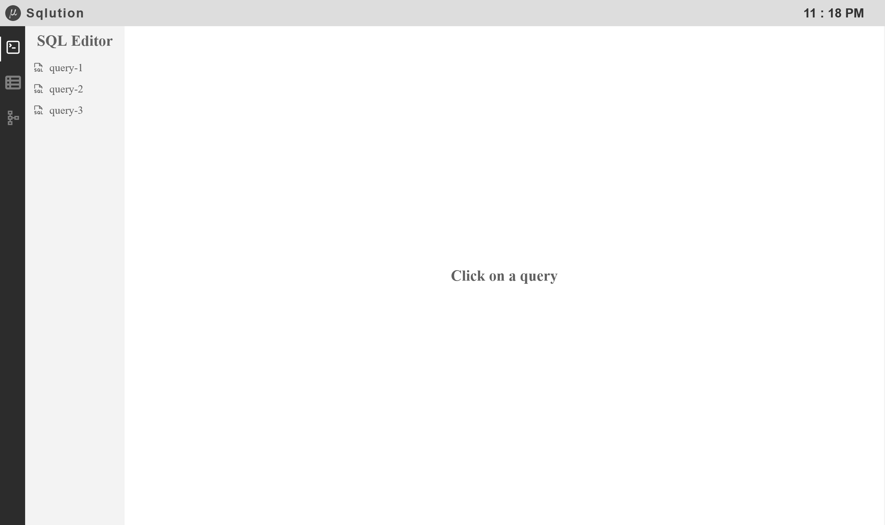
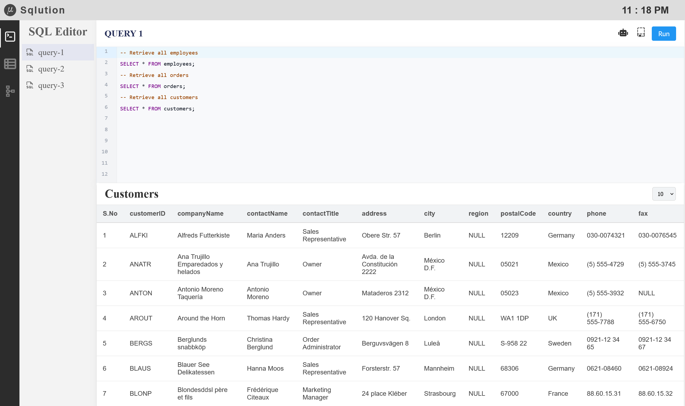
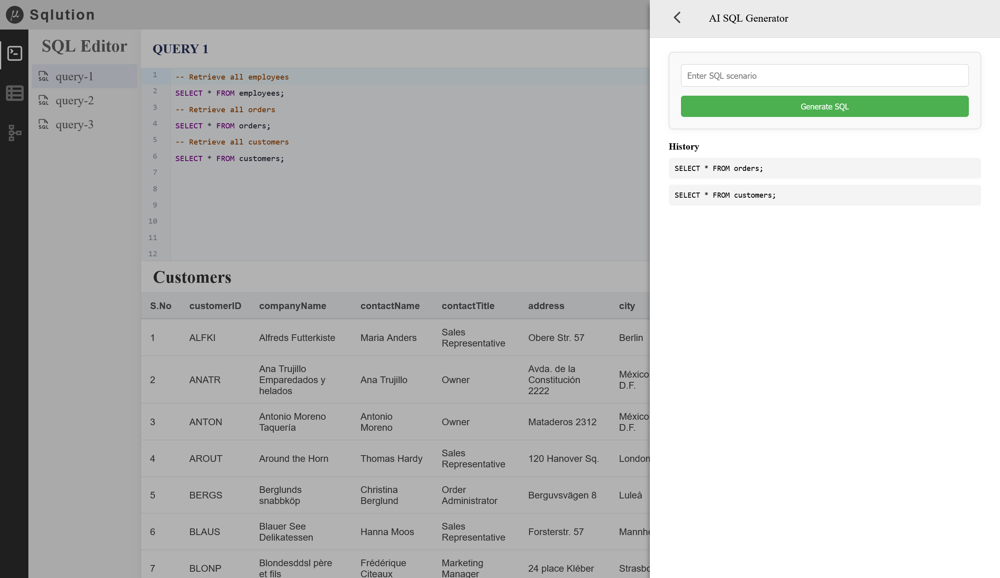
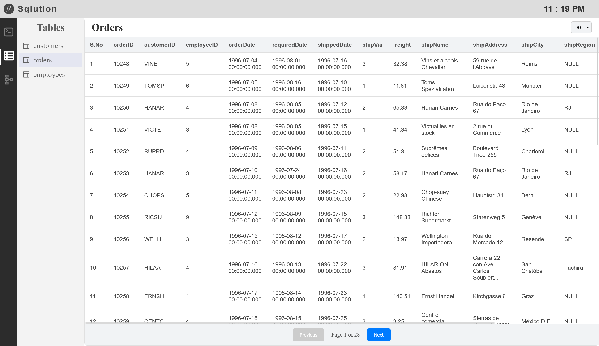
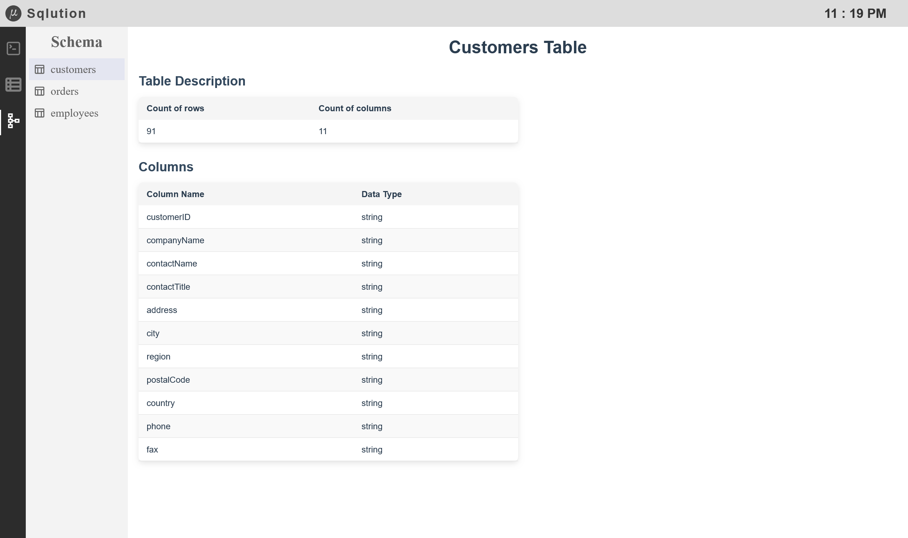
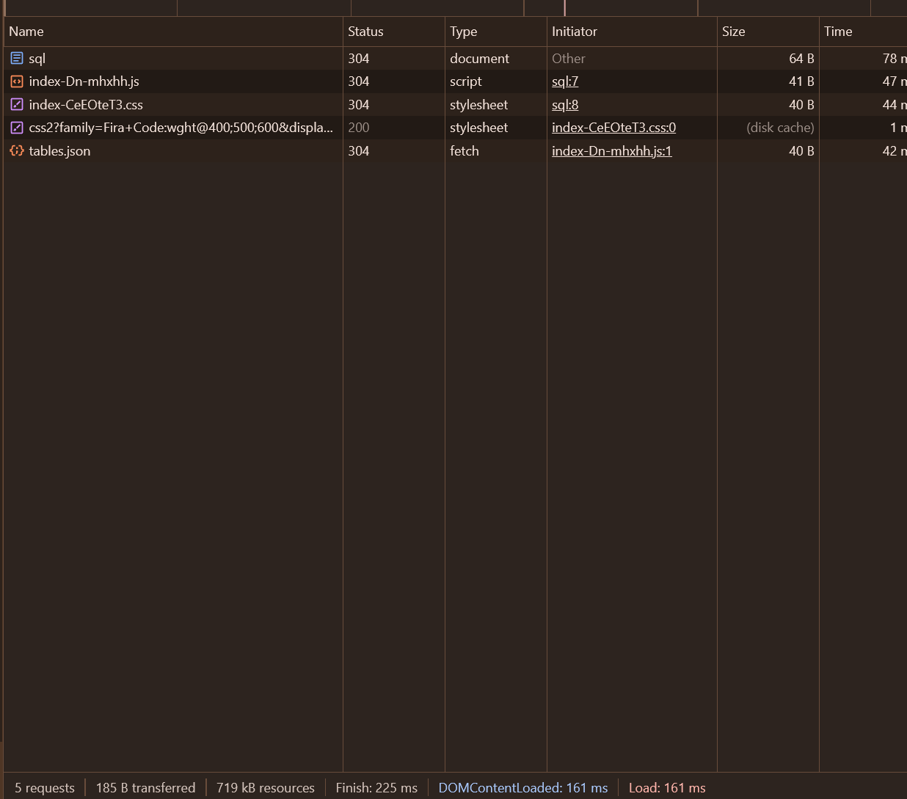
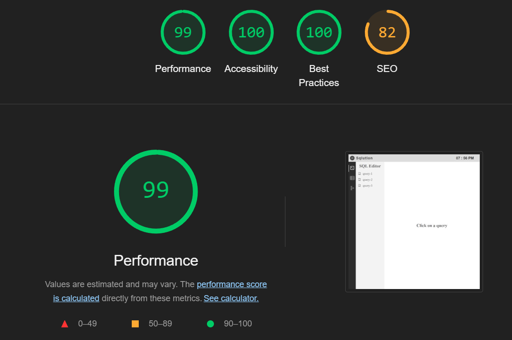
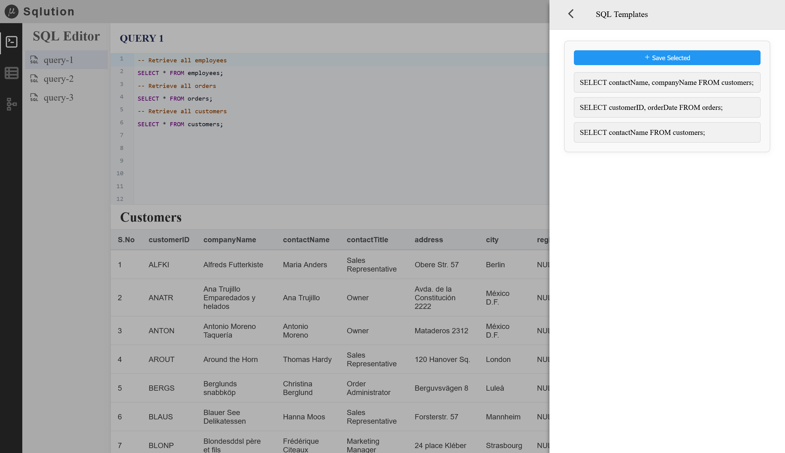

# Sqlution – SQL Query Editor

A frontend SQL query editor built as a **take-home project for a company interview**. Sqlution provides an intuitive interface for writing and executing SQL queries against mock datasets, with AI-powered query generation, a template manager, and a schema/table explorer - all running entirely in the browser.

---

## Features

### SQL Editor
- Built on **CodeMirror 6** with syntax highlighting, auto-completion, and bracket matching
- Supports `SELECT *`, `SELECT col FROM table`, and other common SQL patterns
- Execute the full query, a **highlighted selection**, or the **last non-empty line**
- Query state is persisted in `localStorage` across sessions

### AI-Powered Query Generator
- Integrates **Google Gemini 1.5 Flash** to convert natural language prompts into SQL
- Generated queries are injected directly into the editor
- Full AI query history is stored in `localStorage` for reuse

### SQL Template Manager
- Highlight any SQL snippet and save it as a reusable template
- Click a saved template to insert it at the cursor position
- Templates persist across sessions via `localStorage`

### Table & Schema Viewer
- `/table/:name` - browse paginated rows fetched from mock JSON datasets
- `/schema/:name` - inspect column names and data types for any table
- Sidebar shows available tables: `employees`, `orders`, `customers`

### Performance
- React `useCallback` / `useMemo` to minimise unnecessary re-renders
- Paginated results prevent large-dataset browser strain
- Minified production build via `terser` - **Lighthouse score: 99**

---

## Tech Stack

| Category                | Technology                                                    |
|-------------------------|---------------------------------------------------------------|
| **Framework**           | React 18 + Vite 6                                             |
| **Language**            | TypeScript 5.7                                                |
| **State Management**    | Zustand 5                                                     |
| **SQL Editor**          | CodeMirror 6 (`@codemirror/lang-sql`)                         |
| **AI Integration**      | Google Generative AI SDK (`gemini-1.5-flash-8b`)              |
| **Routing**             | React Router 7                                                |
| **UI Components**       | `react-sliding-pane`, `react-modal`, `react-loader-spinner`   |
| **Icons**               | `react-icons`                                                 |
| **Styling**             | Custom CSS                                                    |
| **Build / Bundling**    | Vite + `terser` minification                                  |
| **Containerisation**    | Docker (multi-stage) + Docker Compose                         |

---

## Architecture

### Application Flow

Sqlution follows a clean, page-per-feature structure managed by React Router:

```
/               → redirects to /sql
/sql            → query list (click a query to open it)
/sql/:queryId   → SQL editor + result table for the selected query
/table          → table list
/table/:name    → paginated table viewer for a specific dataset
/schema         → schema list
/schema/:name   → column/type metadata for a specific table
```

The top-level `NavbarPage` acts as the persistent shell (sidebar + navbar) and renders child routes via `<Outlet>`.

### Query Execution

1. User writes or selects a query in the CodeMirror editor.
2. Clicking **Run** passes the query string to `sqlCommands()` in `sqlEditorMisc.ts`.
3. `sqlCommands` parses the SQL, extracts the target table and requested columns.
4. The `useFetch` hook fetches the matching `public/data/<table>.json`.
5. `TableDisplayer` renders the filtered columns with client-side pagination.
6. On parse failure, an error state is shown instead.

### AI Query Generation

1. User opens the **AI Assist** sliding pane and types a natural language prompt.
2. The prompt is sent to Gemini 1.5 Flash via `@google/generative-ai`.
3. The returned SQL (stripped of markdown fences) is shown in the pane.
4. Clicking the output inserts it at the current cursor position in CodeMirror.
5. All generated queries are appended to `localStorage` for the history list.

### State Management

- **Zustand** (`useSidebarStore`) manages sidebar open/close state globally.
- All other state is local to the component or stored in `localStorage` (query, templates, AI history).

### Data Layer

Mock datasets live in `app/public/data/` as static JSON files:

| File                         | Contents                       |
|------------------------------|--------------------------------|
| `employees.json`             | Employee rows                  |
| `employees_metadata.json`    | Column names + types           |
| `orders.json`                | Order rows                     |
| `orders_metadata.json`       | Column names + types           |
| `customers.json`             | Customer rows                  |
| `customers_metadata.json`    | Column names + types           |
| `tables.json`                | Registry of available tables   |

### Folder Structure

```
sqlution/
├── Dockerfile               # Multi-stage Docker build
├── production.yaml          # Docker Compose config
└── app/
    ├── public/
    │   └── data/            # Mock JSON datasets
    └── src/
        ├── components/
        │   ├── SqlEditor.tsx        # CodeMirror editor + AI + templates
        │   ├── TableDisplayer.tsx   # Paginated result table
        │   ├── Sidebar.tsx          # Navigation sidebar
        │   ├── NavbarSidebarMenu.tsx
        │   └── Clock.tsx
        ├── pages/
        │   ├── SqlPage.tsx          # SQL editor view
        │   ├── TablesPage.tsx       # Table browser
        │   └── SchemaPage.tsx       # Schema explorer
        ├── hooks/
        │   └── useFetch.ts          # Generic data-fetching hook
        ├── store/
        │   └── useSidebarStore.ts   # Zustand sidebar state
        ├── utils/
        │   └── sqlEditorMisc.ts     # SQL parse/execution logic
        └── styles/                  # Per-component CSS files
```

---

## Screenshots

### SQL Editor


### AI Query Generator


### Schema Viewer


### Table Viewer


### Template Manager


---

## Performance

### Page Load Statistics



| Metric                 | Value  |
|------------------------|--------|
| **Number of Requests** | 5      |
| **Data Transferred**   | 693 B  |
| **Resources Loaded**   | 719 kB |
| **Finish Time**        | 437 ms |
| **DOMContentLoaded**   | 373 ms |
| **Load Time**          | 373 ms |

### Lighthouse Scores



| Metric             | Score |
|--------------------|-------|
| **Performance**    | 99    |
| **Accessibility**  | 100   |
| **Best Practices** | 100   |
| **SEO**            | 82    |

### Lighthouse Detail



---

## Challenges & Solutions

| Challenge                       | Solution                                                                                   |
|---------------------------------|--------------------------------------------------------------------------------------------|
| **Frontend-only SQL execution** | Custom `sqlCommands` parser extracts table name and columns from raw SQL strings           |
| **Large dataset handling**      | Client-side pagination renders only the current page, keeping the DOM lean                 |
| **Performance**                 | `useCallback` / `useMemo` prevent redundant renders; terser minifies the production bundle |
| **AI output reliability**       | Strip markdown fences from Gemini responses before inserting into the editor               |

---

## Getting Started

### Prerequisites

- Node.js 18+
- A [Google Gemini API key](https://aistudio.google.com/app/apikey)

### Setup

```sh
# 1. Clone the repository
git clone https://github.com/AshrafMd-1/sqlution.git
cd sqlution/app

# 2. Install dependencies
npm install

# 3. Set your Gemini API key
echo "VITE_GEMINI_API_KEY=your_key_here" > .env

# 4. Start the development server
npm run dev
```

### Available Scripts

| Script            | Description                              |
|-------------------|------------------------------------------|
| `npm run dev`     | Start the Vite dev server                |
| `npm run build`   | Type-check and create a production build |
| `npm run preview` | Serve the production build locally       |
| `npm run lint`    | Run ESLint                               |

---

## Docker Deployment

### Build and run with Docker

```sh
# From the repository root
docker build -t sqlution .
docker run -p 3000:3000 sqlution
```

### Run with Docker Compose

```sh
docker compose -f production.yaml up --build
```

The app is served at `http://localhost:3003`.

> **Note:** The Docker image serves the pre-built static assets - the Gemini API key must be baked into the build via the `VITE_GEMINI_API_KEY` build argument, or the AI features will be disabled at runtime.
